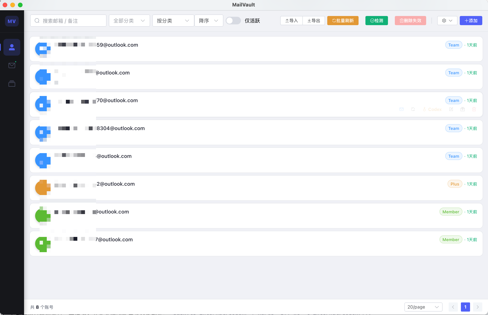
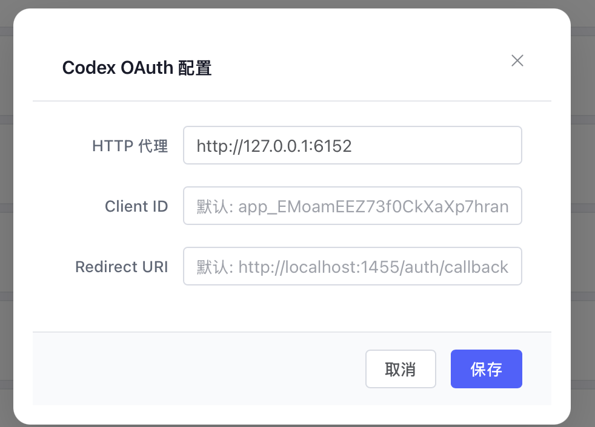
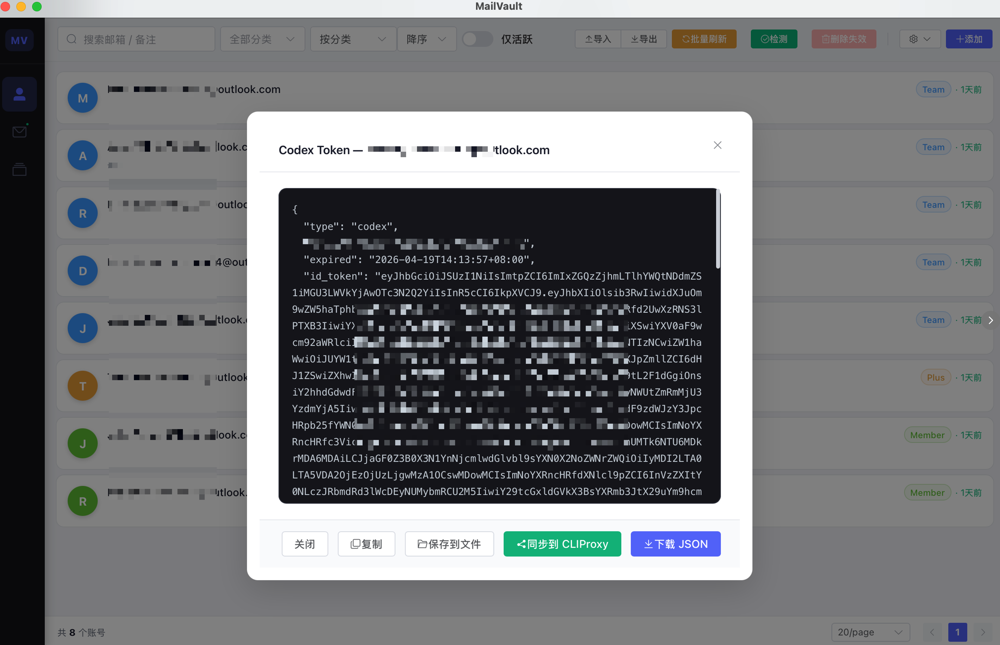
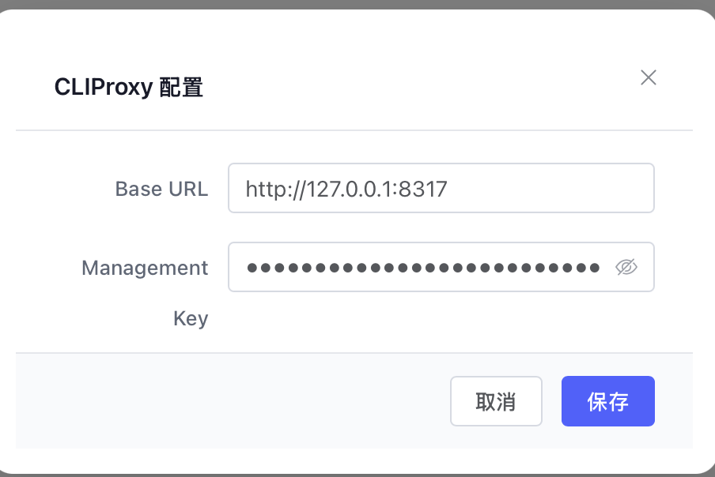
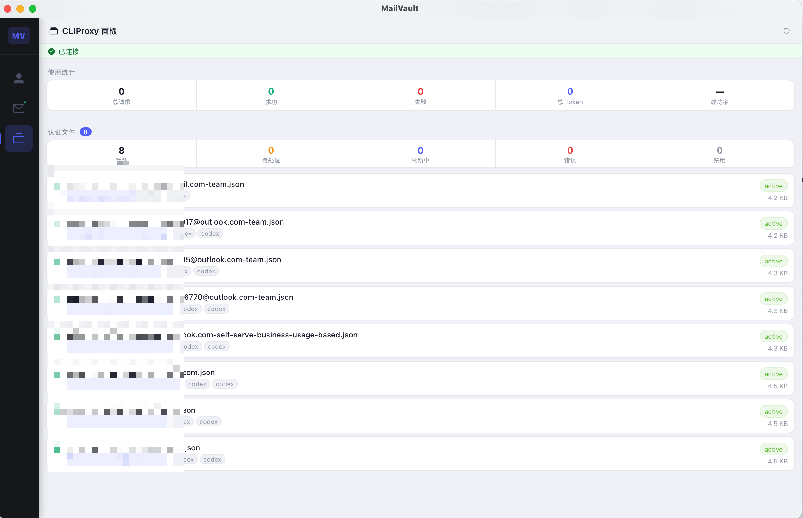

# MailVault

Outlook 邮箱账号管理工具，支持 OAuth2 令牌刷新与 IMAP 邮件读取。

基于 [Wails v3](https://v3alpha.wails.io/) + Vue 3 + Element Plus 构建的跨平台桌面应用。

## 功能

- 账号管理：新增、编辑、删除、归档
- 批量导入 / 导出（`email----password----client_id----refresh_token` 格式）
- OAuth2 令牌刷新（单个 / 全量）
- IMAP 邮件读取（收件箱 / 垃圾邮件）
- 一键存活检测 + 一键删除失效账号
- 账号类型自定义（颜色标签分组）

## 截图

**账号管理**



**Codex OAuth 自动登录**





**CLIProxy 集成**





## 下载

前往 [Releases](../../releases) 页面下载对应平台的预编译包：

| 平台 | 文件 |
|------|------|
| macOS Apple Silicon | `MailVault-macos-arm64.zip` |
| macOS Intel | `MailVault-macos-amd64.zip` |
| Windows x64 | `MailVault-windows-amd64.exe` |
| Linux x64 | `MailVault-linux-amd64.tar.gz` |

> **macOS 首次运行**：解压后将 `.app` 拖入应用程序文件夹，右键 → 打开（绕过 Gatekeeper）

## 导入格式

每行一条，字段间用 `----` 分隔：

```
email----password----client_id----refresh_token
```

## 本地构建

**依赖：**
- Go 1.21+
- Node.js 20+
- [Wails v3 CLI](https://v3alpha.wails.io/getting-started/installation/)

```bash
# 生成前端绑定
wails3 generate bindings

# 构建前端
cd frontend && npm ci && npm run build && cd ..

# 编译二进制
CGO_ENABLED=1 go build -tags production -trimpath -ldflags="-w -s" -o bin/mailvault .
```

或直接运行脚本：

```bash
bash build.sh
```

**开发模式（热重载）：**

```bash
task dev
# 或
wails3 dev -config ./build/config.yml
```

## 技术栈

- **后端**：Go + [Wails v3](https://v3alpha.wails.io/) + GORM + SQLite
- **前端**：Vue 3 + Element Plus + Vite
- **认证**：Microsoft OAuth2 XOAUTH2
- **邮件**：IMAP over TLS (`outlook.live.com:993`)
